# Data ETL 課程大綱

## Agenda

- Data Input / Output：**學會** 讀取不同種的資料格式與輸出。
- Data Manipulation：**學會** 如何將資料操之在手。
- Data Aggregation： **學會** 如何彙總出你有興趣的數字。

# Data I/O : 表格型文件的輸入與輸出

```{r setup, include=FALSE, cache=FALSE}
library(knitr)
library(magrittr)
library(xtable)
library(dplyr)
library(ggplot2)
library(tidyverse)
library(tidyr)
library(stringr)
library(DT)
options('scipen'=100,'digits'=2)
## Global options
options(max.print="75")
opts_chunk$set(echo = TRUE, cache=TRUE, comment="",
               cache.path = ".cache-EDA/")
fig <- function(path, size = 100) {
  sprintf("</img>",
          path, size, size)
}
fig2 <- function(path, size = 100) {
  sprintf("</img>",
          path, size)
}
sys_name <- Sys.info()["sysname"] %>% tolower
sys_encode <- c("utf8", "utf8", "big5")[pmatch(sys_name, c("linux", "darwin", "windows"))]
sessionInfo() %>% capture.output %>% cat(file = "sessionInfo.log", sep = "\n")
```

## 在讀檔案之前，先了解路徑的種類

路徑分為兩種：

- 絕對路徑：一般大家所認知的路徑長相。
- 相對路徑：從 `working directory(工作目錄) 開始尋找`

```{r, eval = F}
## 查看目前 Working directory 在哪個位置
getwd()
## 查看該工作目錄底下有什麼檔案
dir()
## 更改、設定工作目錄位置
# setwd('這邊放路徑')
```


## 輸入表格檔案(1/3)

- [下載範例資料](https://raw.githubusercontent.com/JohnsonHsieh/LearnR-2020/master/data/transaction.csv)
- 利用`read.csv` 讀取 `csv` 檔 (一種以逗點分隔欄位的資料格式)    
- 路徑必須指到下載的位置

```{r, eval = F}
############### 絕對路徑 ###############
# 請輸入完整的檔案路徑
transaction <- read.csv("/Users/LearnR/Desktop/data/transaction.csv") #如果你是mac
transaction <- read.csv("C:\\Users\\transaction.csv") #如果你是windows
############### 相對路徑 ###############
# 設定我們檔案存放的路徑
setwd()
# 讀檔起手式
transaction <- read.csv("transaction.csv")
# 若讀入的是亂碼，猜猜看以下兩種編碼 utf-8 and big5
transaction <- read.csv("transaction.csv",fileEncoding = 'big5')
transaction <- read.csv("transaction.csv",fileEncoding = 'utf-8')
```

## 輸入表格檔案(2/3)

看看資料輸入後的結果有沒有問題:

```{r, eval = F}
transaction <- read.csv("data/transaction.csv")
head(transaction)
```

```{r, cache = T, echo = F}
transaction <- read.csv("data/transaction.csv")
```

<center></center> . . .

---

```{r echo = FALSE,fig.height=3, warning=FALSE, fig.align='center', message=FALSE, results='asis'}
data.frame(英文欄位名稱=c("city","district","trac_year","trac_month","trac_type","trac_content",
                   "use_type","build_type","build_ymd","area_land","area_build",
                   "area_park","price_total","price_unit"),
           中文欄位名稱=c("縣市","鄉鎮市區","交易年份","交易月份","交易標的","交易筆棟數","使用分區或編定",
                    "建物型態","建築完成年月","土地移轉總面積.平方公尺.","建物移轉總面積.平方公尺.",
                    "車位移轉總面積.平方公尺.","總價.元.","單價.元.平方公尺.")) -> name

```

<div style='float:left;width:48%;'>

```{r, echo = FALSE}
name[1:7,] %>% knitr::kable()
```

</div>

<div style='float:right;width:50%;'>

```{r, echo = FALSE}
name[8:14,] -> name2
rownames(name2) <- c(1:7)
name2 %>% knitr::kable()
```

</div>


## 輸入表格檔案(3/3)

若是資料不如 `csv` 檔以 `,` 做分隔呢？

`read.table()`可以解決上述的問題，透過`?read.table()`可以查看其中可以調整的參數。注意到`sep = `是指定要輸入的資料是用什麼符號做分隔，當 `read.table()` 的 `sep = ','`時，跟 `read.csv()` 是相同的。

```{r, eval = F}
transaction <- read.csv("data/transaction.csv")
transaction <- read.table("data/transaction.csv", sep = ',', header = T)
```


## 輸出表格檔案

利用`write.csv`將`data.frame`格式的R物件另存成csv檔。為了效率，我們僅將 `head(data)` 6筆資料做輸出成 `transaction_head.csv` 即可。

```{r echo=TRUE, eval=FALSE}
write.csv(head(transaction), "transaction_head.csv", row.names=FALSE, quote=FALSE)
```

<center>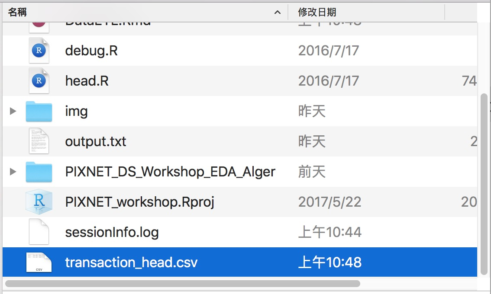</center>


# Data I/O :常見的讀取錯誤

## 排解疑難 - 常見的讀取錯誤1

路徑錯誤

```{r echo=TRUE, eval=FALSE}
path <- "wrong_file_path"
dat <- read.csv(file = path)
```

<pre>
Error in file(file, "rt") : 無法開啟連結
此外: Warning message:
  In file(file, "rt") : 無法開啟檔案 'wrong_file_path' ：No such file or directory
</pre>

- 絕對路徑 -> 確認檔案是否存在
- 相對路徑 -> 利用`getwd`了解 R 當下的路徑位置


## 排解疑難 - 常見的讀取錯誤2

格式錯誤

```{r echo=TRUE, eval=FALSE}
path <- "data/transaction.csv"
dat <- read.csv(file = path, header = TRUE, sep = "1")
```

<pre>
Error in read.table(file = file, header = header, sep = sep, quote = quote,  :
  more columns than column names
</pre>

- 利用**其他編輯器**確認分隔符號
- 確認每列的資料的欄位是正確的
- 必要時，請用其他文件編輯器校正欲讀取的檔案

## 排解疑難 - 常見的讀取錯誤3

編碼錯誤

```{r echo=TRUE}
url <- "http://johnsonhsieh.github.io/dsp-introR/data/dsp-gift-2013-big5/%E8%B2%B7%E8%B3%A3st_A_10109_10109.csv"
```

```{r echo=TRUE, eval=FALSE}
dat <- read.csv(url)
```

<pre class="code">
Error in make.names(col.names, unique = TRUE) :
  無效的多位元組字串於 <b6>m<c2><ed><a5><ab><b0><cf>
</pre>

- 查詢檔案的編碼
- 常見的中文編碼有**UTF-8**和**BIG-5**

```{r echo=TRUE, eval=FALSE}
# 利用`fileEncoding`參數選擇檔案編碼 - big5 / utf8
dat2 <- read.csv(url, fileEncoding = "big5")
```


# Data I/O : 讀取其他軟體資料集

## 讀取JSON檔案 (1/2)

```{r, eval = F}
install.packages("jsonlite")
```
```{r,include=FALSE}
library(jsonlite)
```

<center>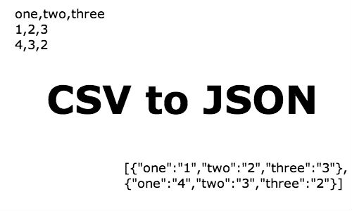</center>

## 讀取JSON檔案 (2/2)

- `fromJSON`: 將 `JSON` 轉換成 Factor, DataFrame, Matrix 等格式，`?fromJSON` 查詢。
- `toJSON`: `?toJSON`

```{r}
json <-
'[
  {"Name" : "Mario", "Age" : 32, "Occupation" : "Plumber"},
  {"Name" : "Peach", "Age" : 21, "Occupation" : "Princess"}
]'
mydf <- fromJSON(json)
mydf
```

## 讀取其他軟體資料集

- For SPSS and Stata datasets, use the `foreign` package
  - Cars: [Cars.sav](http://calcnet.mth.cmich.edu/org/spss/V16_materials/DataSets_v16/Cars.sav)
- Milk Production: [p004.dta](https://stats.idre.ucla.edu/stat/stata/examples/chp/p004.dta)

```{r, eval = F}
# install.packages("foreign") # 安裝R套件 foreign
library(foreign) # 載入套件
cars <- read.spss("data/Cars.sav", to.data.frame = TRUE)
milk <- read.dta("data/p004.dta")
# head(cars)
# head(milk)
```

## 讀取其他軟體資料集

- For SAS datasets, use the `sas7bdat` package
- airline: [airline.sas7bdat](http://www.principlesofeconometrics.com/sas/airline.sas7bdat)

```{r}
# install.packages("sas7bdat")
library(sas7bdat)
airline <- read.sas7bdat("data/airline.sas7bdat")
head(airline)
```

# Data I/O : 讀取網頁內容 (Lite)

## 逐行輸入與輸出

- `readLines`, `writeLines`
- 是讀取網頁原始碼的好工具

```{r echo=TRUE}
output <- file("output.txt")
writeLines(as.character(1:12), con = output)
input <- readLines(output)
input
```


## 練習

找出[清心福全](http://www.319papago.idv.tw/lifeinfo/chingshin/chingshin-02.html)台北市南港店的地址

```{r echo=TRUE}
web_page <- readLines("http://www.319papago.idv.tw/lifeinfo/chingshin/chingshin-02.html")
# 如果你是windows, 這邊會遇到編碼問題，請加:
# web_page <- readLines("http://www.319papago.idv.tw/lifeinfo/chingshin/chingshin-02.html",encoding = 'UTF-8')
matches <- gregexpr("台北市南港區[\u4E00-\u9FA5|0-9]+", web_page)
tmp <- regmatches(web_page, matches)
unlist(tmp) # 把 list 轉成 vector
```

---

其中：
```
[\u4E00-\u9FA5]  ：表示所有中文字符
|                 :表示 或
[0-9]	           ：含數字之字串
[a]+             ：一或多個 a
```
此寫法為 **正規表示法**，後續將會在 **字串處理** 的主題中跟各位介紹。


## 小挑戰

- 找出清心福全台北市門市的電話號碼
- 提示：`"02-[0-9]+"`

## 小挑戰

- 找出清心福全台北市門市的電話號碼
- 提示：`"02-[0-9]+"`

### 參考解答：

```{r echo=TRUE}
web_page <- readLines("http://www.319papago.idv.tw/lifeinfo/chingshin/chingshin-02.html")
matches <- gregexpr("02-[0-9]+", web_page)
tmp <- regmatches(web_page, matches)
head(unlist(tmp))
```

# Data I/O : 檢視資料

## Recap 一下 Data I/O 我們學了什麼？

**Data ETL 的第一步：輸入資料**

- 設定資料路徑：`getwd()` & `setwd()`
- 輸入不同資料型態：
    - 表格式： `read.csv()` & `read.table()`
    - 網頁： `readLines()`
    - 其他軟體：`read.sas7bdat()` & `read.spss()`
    - 注意編碼、路徑設定、資料內容有沒有錯誤
- 輸出資料：`write.csv()`

## 輸入資料後下一步：檢視資料有無異常

輸入資料後，我們才準備正要開始 ETL 呢！

複習一下常用的資料檢視方式：

- 總覽
    - `head()`, `tail()`：抓前五筆、後五筆資料
    - `str()`, `summary()`：檢視資料的結構、簡單敘述性統計
    - `View()`：自由瀏覽
- 單一欄位檢視
    - `unique()`：檢視類別型欄位
    - `table()`：檢視類別型欄位

## 資料總覽

```{r}
head(transaction)
```

---

```{r}
tail(transaction)
```

---

`str()` 會檢視資料中每個欄位的：型態(int, Factor, chr, ...)以及值

```{r, eval=F}
str(transaction)
```

<center>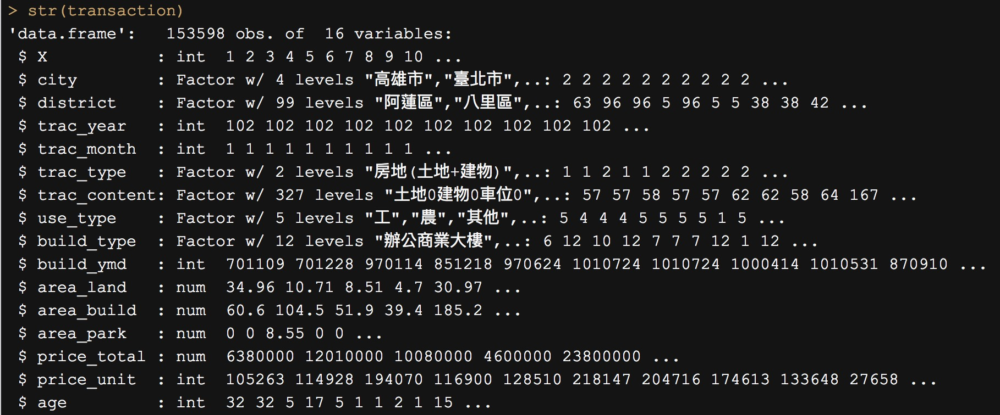</center>

----

`summary` 會檢視資料中每個欄位敘述性統計(值的分佈)

```{r, eval = F}
summary(transaction)
```

<center></center>

----

`View()`

```{r, eval = F}
View(transaction)
```

<center></center>

## 單一欄位檢視

```{r}
table(transaction$city)
```

```{r}
unique(transaction$district)
```

# Data Manipulation

# Data Manipulation : Pipe Line Coding Style

## 為什麼這邊要教 Pipeline Coding style ?

根據~~不具名~~調查指出，寫程式花了將近 80% 時間在思考**如何命名物件名稱**。

命名物件名稱是門藝術，當然我們也可以隨性命名：

```{r}
## 假設我們現在要做這件事情
species <- iris$Species
species_again <- as.character(species)
species_again_again <- table(species_again)
species_again_again
```

-----

當然我們也可以這樣改寫，節省命名的時間：

```{r}
table(as.character(iris$Species))
```

## 為什麼這邊要教 Pipeline Coding style ?

當整份 `.r` 檔都是這樣的寫法時，你會發現幾個問題：

- 解讀程式碼不直覺：我們習慣從外往內解讀 `table -> as.character -> iris$...`
- 要改寫程式碼也較不容易

所以我們需要一個更直覺的工具幫助我們解決這些問題 ...

## 2014 年最有影響的套件之一：magrittr

- 壓縮的程式碼不好讀
- 展開的程式碼會產生很多暫存變數
\
\
<h3> **magrittr 套件聽到大家的聲音了！**
  
</h3>

- 運用 `magrittr` 所開發的 `%>%` 進行 Pipeline coding style
- 養成 Pipeline Style 的 coding 習慣，上述問題迎刃而解！
    - Pipeline 快捷鍵(MAC)：`command + shift + M`
    - Pipeline 快捷鍵(WIN)：`ctrl + shift + M`

## 基本算子 (`%>%`)

<iframe src="https://giphy.com/embed/aeSS6NKPqOKQ" width="450" height="330" frameBorder="0" class="giphy-embed" allowFullScreen></iframe>

## 基本算子 (`%>%`)

- 想像一下程式的寫作與閱讀邏輯
- `%>%` 會將算子左邊的物件 (object) 傳到右邊的函數 (function) 中第一個 argument
- . 點號適合用在欲傳入變數不是在傳入函數的第一個位置時使用
- use `x %>% f`, rather than `f(x)`
- or use `x %>% f(y, z)`, rather than `f(x, y, z)`
- or `y %>% f(x, ., z)`, rather than `f(x, y, z)`
- 更多 Pipeline 請參考 Johnson Hsieh 的[講義](https://rawgit.com/DataScienceHC/sandbox-for-datasci/master/%5B2015-08-12%5D%20R%20code%20with%20pipes/index.html)

```{r}
# install.packages("magrittr")
library(magrittr)
x <- 1:10
x %>% mean # 由左而右順序操作
```

---

```{r}
# 指令壓縮
plot(density(sample(mtcars$mpg, size=10000, replace=TRUE),
             kernel="gaussian"), col="red", main="density of mpg")
```

----

```{r}
# Pipe Line
mtcars$mpg %>%
    sample(size=10000, replace=TRUE) %>%
    density(kernel="gaussian") %>%
    plot(col="red", main="density of mpg")
```


# Data Manipulation : 字串資料處理

## tidyverse 套件

`stringr` 是專門處理字串的一個知名套件，他與之後會介紹的強大套件 `dplyr`, `tidyr`, `ggplot2` 皆整合至 `tidyverse` 套件之中了。

<center>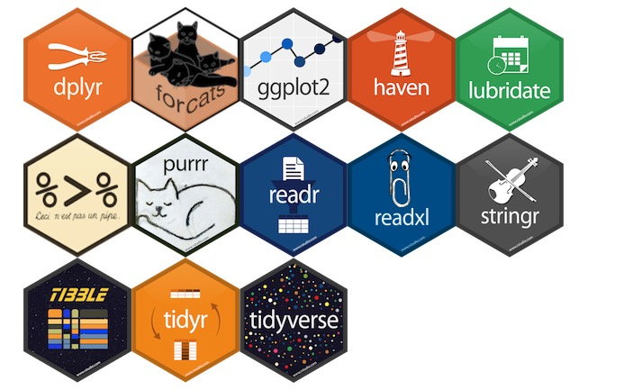</center>

## tidyverse 套件安裝

我們先安裝 `tidyverse` 套件：

```{r, eval = F}
install.packages("tidyverse")
```

```{r}
library(tidyverse)
library(stringr)
```

## stringr 基本介紹

[所有的 stringr 的 function](http://stringr.tidyverse.org/reference/index.html) 皆用 `str_` 作為開頭（記得善用 Tab 鍵唷！）

我們用先前的 `transaction` 資料來練習一下字串處理吧！

以 `transaction` 的 `build_ymd` 建築年月日為例:

```{r}
build_ymd <- transaction$build_ymd
build_ymd %>% head()
```

## stringr：str_length & str_sub 字串長度與字串擷取

- **目標：取出 build_ymd 的年、月、日**
- 注意：字串的長度不同(6與7)
- 善用 `?str_sub` 查詢 function 使用方法

```{r}
year <- ifelse(str_length(build_ymd) == 6,
               str_sub(build_ymd, 1,2),
               build_ymd %>% str_sub(1,3)) # 這兩種寫法都可以
year_unique <- year %>% unique()
year_unique
```

---

若不寫 ifelse, 我們也可以：

- start = 1 : 從第一個開始
- end = -5 : 到倒數第五個

```{r}
year_unique2 <- str_sub(build_ymd, 1,-5) %>% unique()
any(year_unique != year_unique2) # check 有沒有任何一個不一樣
```

## stringr : str_detect 字串檢驗

- **目標：從 build_type 中判斷是否有電梯**
- 善用 `?str_detect` 查詢 function 使用方法

```{r}
build_type_vector <- transaction$build_type
build_type_vector %>% str_detect('有電梯') %>% table
```

## stringr : str_split 字串分割

- **目標：根據 fruit 中的 and 進行切割**
- 善用 `?str_split` 查詢 function 使用方法

```{r}
fruits <- c(
  "apples and oranges and pears and bananas",
  "pineapples and mangos and guavas")
str_split(fruits, " and ")
str_split(fruits, " and ", simplify = TRUE) # simplify = T > 回傳矩陣
```


## stringr : str_replace 字串取代

- **目標：將 trac_type 中的`房地`拿掉**
- 善用 `?str_replace` 查詢 function 使用方法

```{r}
trac_type <- transaction$trac_type
trac_type %>% str_replace('房地','') %>% head
```

## stringr : str_replace 字串取代 {.build}

- 目標：將 trac_type 中的`(土地+建物)`拿掉
- 善用 `?str_replace` 查詢 function 使用方法

```{r}
trac_type <- transaction$trac_type
trac_type %>% str_replace('(土地+建物)','') %>% head
```

<center></center>

## 正規表示法 Regular Expression

正規表示法是一種描述文字模式的語言，可以讓我們撰寫程式來自文字中比對、取代甚至是抽取各種資訊。

[參考 Wush Wu 所撰寫的教材](http://datascienceandr.org/articles/RegularExpression.html)，開頭或結尾的簡單的例子：

- `^AA`:表示以`AA`為開頭的規則
- `AA$`:表示以`AA`為結尾的規則

```{r}
str_detect(c('AA1','A2','V3','AAA4','ACA21'),'^AA')
str_detect(c('AA1','A2','V3','AAA4','ACA21'),'1$')
```


## `(土地+建物)`無法辨識的原因

stringr 中的 `pattern`參數預設使用正規表示法，剛剛我們所要比對的規則`(土地+建物)`中的`(`,`+`,`)`皆是正規表示法中的特殊符號，如果這些剛好是要比對的文字，那就要加上跳脫字元"\\"。又剛好跳脫字元"\\"也是R 的字串的跳脫字元，所以我們在輸入時，一個"\\"就要輸入兩次。

```{r}
trac_type %>% str_replace('\\(土地\\+建物\\)','') %>% head
```

# Data Manipulation : 資料基本操作

## 2014 年最有影響的套件之一：dplyr

- 讓R 使用者可以用更有彈性的方式來處理資料
- 針對`data.frame`做設計（名稱中的`d`）
- 設計理念
    - 導入資料整理最重要的動作（非常類似SQL）
    - 快
    - 支援異質資料源（`data.frame`或資料庫中的表格）

## 學習dplyr的官方方式：`vignette`

```{r dplyr-vignette, echo = TRUE, eval=FALSE}
vignette(all = TRUE, package = "dplyr")
vignette("dplyr", package = "dplyr")
```

- 更詳細的dplyr介紹可以閱讀dplyr的小論文
- R 的開發者會針對一個主題撰寫小論文做介紹

## dplyr簡介 {.columns-2}

- `filter` 對列做篩選 (row)
- `select` 對欄做篩選 (column)
- `arrange` 排列
- `mutate` 更改欄或新增欄
- **`group_by` + `summarise` 分類

<center>`r fig("R_ETL_Fn1.png")`</center>

出處：[資料科學愛好者年會資料分析上手課程：ETL1](https://www.youtube.com/watch?v=JD1eDxxrur0)

## `filter` : 對列做篩選

<center>
</img>
</center>

## `filter` : 對列做篩選

- 目標：取出 city 為 '臺北市'

```{r, eval = F}
library(dplyr) #載入套件
transaction %>%
  filter(city == '臺北市') %>% head
```

<center></center>

## `select` : 對行做選取

<center>
</img>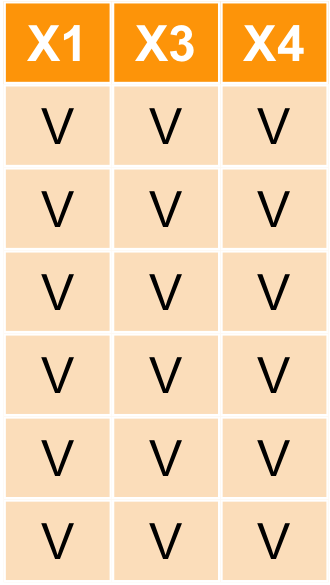
</center>

## `select` : 對行做選取

- 目標：取出 `city`, `district`, `price_total` 欄位

```{r}
transaction %>%
  select(city, district, price_total) %>%
  head()
```

## `select` : 對行做選取

也可以用負號`-`執行反向選取

```{r, eval= F}
transaction %>%
  select(-c(city, district, price_total))%>%
  head()
```

<center>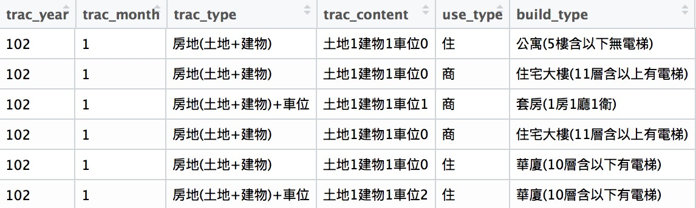</center>

## `arrange` : 資料排序

<center>
</img></img>
</center>

## `arrange` : 資料排序

- 目標：按照總價格 `price_total` 由小到大進行排序
- 注意：可以發現到 price_total 似乎有一些值不合理？(0)如何檢驗？ -> ETL

```{r}
transaction %>% arrange(price_total) %>% select(X,city, price_total) %>% head
```

## `arrange` : 資料排序

- 排序預設是由小到大，加上`desc`可使用遞增排列

```{r}
transaction %>% arrange(desc(price_total)) %>%
  select(X,city, price_total) %>% head
```

## `mutate` : 新增/修改欄位

<center>
</img>
</center>


## `mutate` : 新增/修改欄位

- 目標：根據 `area_build` , `price_total` 自行計算單位坪價

```{r}
transaction_new <- transaction %>%
  mutate(price_per_unit = price_total/area_build)
transaction_new %>% select(price_total, area_build, price_per_unit) %>% head
```

## 其他 dplyr 基本常用 function

- 移除重複資料: `distinct(transaction)`
- 隨機抽取資料: `sample_n(transaction, 5)`
- 抽取指定列: `slice(transaction, c(1,3,4,5))`
- 更多請見[dplyr Cheatsheet](https://www.rstudio.com/wp-content/uploads/2015/02/data-wrangling-cheatsheet.pdf)

## Data Manipulation 小挑戰

- 目標：利用`build_type`欄位挑出 **有電梯** 的資料
- 方法：`filter()` + `str_()`

```{r, echo = F}
transaction %>%
  filter(build_type %>% str_detect('有電梯')) %>%
  head %>%
  datatable(options = list(dom = 't',scrollX = TRUE, fixedColumns = TRUE,
                           initComplete = JS("function(settings, json) {",
      "$(this.api().table().header()).css({'background-color': '#000', 'color': '#fff'});",
      "}")),extensions = 'FixedColumns')
```

## Data Manipulation 小挑戰參考解答

```{r, echo = T, eval = F}
transaction %>%
  filter(build_type %>% str_detect('有電梯')) %>%
  head
```

## 小挑戰2

- 目標：請挑出 在台北市中山區與北投區的交易資料，並且新增`is_elevator` 是否有電梯的欄位，若有電梯則填入'TRUE'，若無則填入'FALSE'，並且以屋齡做遞增排序，僅保留`city`, `district`, `age`, `price_unit` 等欄位。
- Tips : 多個條件配對可用 `%in%`。 ex: `apple` %in% `c('apple', 'banana')`

```{r, echo = F}
transaction %>%
  filter(city == '臺北市', district %in% c('中山區','北投區')) %>%
  mutate(is_eleavator = str_detect(build_type, '有電梯')) %>%
  arrange(age) %>%
  select(city, district, age, price_unit) %>% head
```

----

```{r, eval=F}
transaction %>%
  filter(city == '臺北市', district %in% c('中山區','北投區')) %>%
  mutate(is_eleavator = str_detect(build_type, '有電梯')) %>%
  arrange(age) %>%
  select(city, district, age, price_unit) %>% head
```


# Data Manipulation: 資料型態轉換

## 資料型態轉換 : Wide format <-> Long format {.build}

<center></img></center>

事實上 **Long-format** 的資料的格式不容易讓人類做比較。反而比較易於電腦讀取，人類在吸收資訊的時候更適合看 **wide-format**。

接著我們就來介紹如何做資料型態的轉換囉！long-format <-> wide-format

## spread & gather : 長轉寬

接著我們來介紹 tidyr 中的 `spread` & `gather` 這兩個 Function：

- `?spread` : key 擺放要展開的欄位，value 展開欄位後對應填入的值

```{r}
library(tidyr) # 載入套件
long <- data.frame(id = c(1,1,2,2,3,3),
                   sex = c(rep('female',2),rep('male',4)),
                   class = rep(c('math','science'), length.out = 6),
                   score = c(41, 47, 53, 63, 54, 58))
wide <- long %>% spread(class, score)
wide
```

## spread & gather : 寬轉長

- `?gather` :
    - key、value : 皆放欄位名稱
    - `-c(id, sex)` : 這兩個欄位不要轉換

```{r}
wide %>%
  gather(key = 'class',value = 'score', -c(id,sex))
```

# Data Manipulation : 資料合併

## `bind_` 資料表合併 {.columns-2}

- dplyr::`bind_rows()`

</img>

- dplyr::`bind_cols`

</img>

## `_join` 資料表合併

**join family：left_join**

```{r, eval = F}
left_join(a, b, by = "x1")
```

<left></img></left>
<right>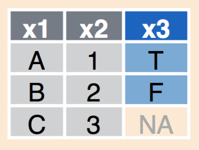</img></right>

## `_join` 資料表合併

**join family：right_join**

```{r, eval = F}
right_join(a, b, by = "x1")
```

<left></img></left>
<right></img></right>

## `_join` 資料表合併

**join family：inner_join**

```{r, eval = F}
inner_join(a, b, by = "x1")
```

<left></img></left>
<right>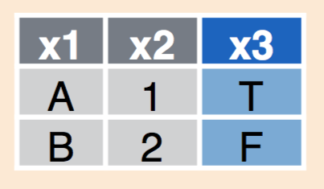</img></right>

## `_join` 資料表合併

**join family：full_join**

```{r, eval = F}
full_join(a, b, by = "x1")
```

<left></img></left>
<right></img></right>


## `union (聯集)` 資料表合併

```{r, eval = F}
union(y, z)
```

<left>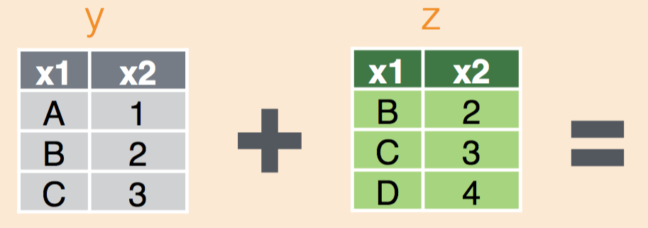</img></left>
<right>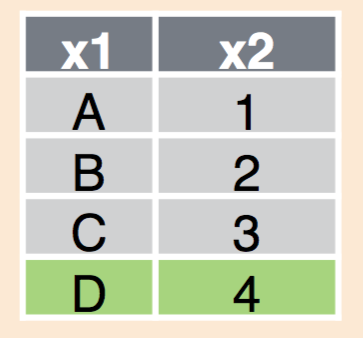</img></right>


## `intersect (交集)` 資料表合併

```{r, eval = F}
intersect(y, z)
```

<left></img></left>
<right>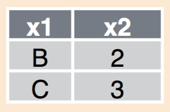</img></right>


## `setdiff (插集)` 資料表合併

```{r, eval = F}
setdiff(y, z)
```

<left></img></left>
<right></img></right>


# Data Aggregation : 樞紐分析

## 樞紐分析 `group_by` + `summarise`

<center>
</img></img>
</center>

## 樞紐分析 `group_by` + `summarise()`

- 目標：計算 **各縣市** 的交易**筆數**與**平均坪價**，並以高排到低。
- 利用`?dplyr::summarise` 查看可以擺什麼 `summary functions`
    - `min()`, `max()`
    - `n()`, `mean()`
    - 更多請見 dplyr cheatsheet

## 樞紐分析 `group_by` + `summarise(n())`    

- 利用`group_by` + `summarise` + `arrange(desc)`
    - `summarise` 中的擺放的`fun`為 `n()` = `length()`，表示該 group 中有幾筆資料、`mean(price_unit)`表示該 group 中 price_unit 平均。

```{r}
transaction %>%
  group_by(city) %>%
  summarise(n = n(), mean = mean(price_unit, na.rm=T))
```

## 樞紐分析 `group_by` + `summarise(max)`

- 目標：計算 **各縣市** 的最高的**平均坪價**為多少？

```{r}
transaction %>%
  group_by(city) %>%
  summarise(max_price = max(price_unit, na.rm=T))
```


## 樞紐分析小挑戰

<center>請列出**臺北市的各行政區**於**各種住宅型態**的**平均單位坪價**，由平均高至低做排序。</center>

- Tips : filter -> group_by(a,b) -> summrise() -> arrange

```{r, echo = F}
transaction %>%
  filter(city == '臺北市') %>%
  group_by(district, build_type) %>%
  summarise(mean = round(mean(price_unit, na.rm = T))) %>%
  head %>%
  datatable(options = list(dom = 't',scrollX = TRUE, fixedColumns = TRUE,initComplete = JS("function(settings, json) {","$(this.api().table().header()).css({'background-color': '#000', 'color': '#fff'});","}")),extensions = 'FixedColumns')
```

---

```{r, eval = F}
transaction %>%
  filter(city == '臺北市') %>%
  group_by(district, build_type) %>%
  summarise(mean = mean(price_unit, na.rm = T))
```


## 樞紐分析小挑戰之資料型態轉換

`summarise` 所回傳的 long-format 其實較適合我們後續畫圖(ggplot2)的資料型態，這部份各位會在下一次 `EDA and Visualization in R`的課程中感受到！

我們利用先前學的資料型態轉換的技巧來將結果轉成方便讀比較的形式

```{r, eval = F}
transaction %>%
  filter(city == '臺北市') %>%
  group_by(district, build_type) %>%
  summarise(mean = mean(price_unit, na.rm = T)) %>%
  spread(build_type, mean)
```

---

```{r, echo = F}
transaction %>%
  filter(city == '臺北市') %>%
  group_by(district, build_type) %>%
  summarise(mean = round(mean(price_unit, na.rm = T))) %>%
  spread(build_type, mean) %>%
    datatable(options = list(dom = 't',scrollX = TRUE, fixedColumns = TRUE,initComplete = JS("function(settings, json) {","$(this.api().table().header()).css({'background-color': '#000', 'color': '#fff'});","}")),extensions = 'FixedColumns')
```

# Recap

## **Data ETL 的第一步：輸入資料** {.columns-2}

- 設定資料路徑：`getwd()` & `setwd()`
- 輸入不同資料型態：
    - 表格式：
    `read.csv()` & `read.table()`
    - 網頁： `readLines()`
    - 其他軟體：
    `read.sas7bdat()` & `read.spss()`
    - 注意編碼、路徑設定、資料內容有沒有錯誤
- 輸出資料：`write.csv()`

<center></center>

## **Data Manipulation：將資料操之在手。** {.columns-2}

- 字串取代/配對/長度/位置/切割：
    - `str_`
- 資料表基本操作方式:
    - `filter` 挑選列 `select` 挑選欄
    - `arrange` 排序, `mutate` 新增修改
- 資料表型態轉換：
    - `gather` 寬轉長
    - `spread` 長轉寬
- 資料合併：
    - `_join`：合併資料表
    - `bind_` : 合併列或欄

<center></center>

## **Data Aggregation : 樞紐分析**

- 資料彙總:
    - `group_by` 依照
    - `summarise` 彙總
    `mean`, `median`, `sum`, `max`, `min`, `n`

<center>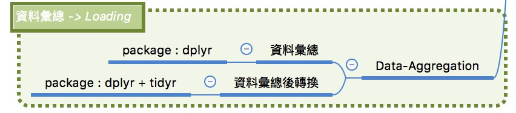</center>

# Finally, ....

## 恭喜大家踏入清資料的坑！

<center></center>

## 非誠勿擾，切勿 GIGO

<center></center>

## 回家作業

請同學完成R語言翻轉教室以下章節：

- `01-RBasic-07-Loading-Dataset`
- `02-RDataEngineer-03-JSON`
- `02-RDataEngineer-05-Data-Manipulation`
- `02-RDataEngineer-06-Join`

選修：

- `02-RDataEngineer-01-Parsing`

## 補充資料

- [必收的 Rstudio 發表的大量 Cheatsheet](https://www.rstudio.com/resources/cheatsheets/)
- [R語言翻轉教室 -- 全中文R語言互動式教材](http://datascienceandr.org/)
- [tidyverse 介紹](http://tidyverse.org/)
- [Introduction to dplyr](https://cran.r-project.org/web/packages/dplyr/vignettes/dplyr.html)
- [Cookbook for R](http://www.cookbook-r.com/)

## 繼續學習之路

- 了解自己的需求，詢問關鍵字與函數
- [Taiwan R User Group](http://www.meetup.com/Taiwan-R)，mailing list: Taiwan-useR-Group-list@meetup.com
- [ptt R_Language版](https://www.ptt.cc/bbs/R_Language/index.html)
- [R軟體使用者論壇](https://groups.google.com/forum/#!forum/taiwanruser)
- [StackOverflow](http://stackoverflow.com/)
- 歡迎來信 <johnson@dsp.im> 或與其他DSP優秀教師多多交流

## 感謝大家！

<center><br><br></center>
